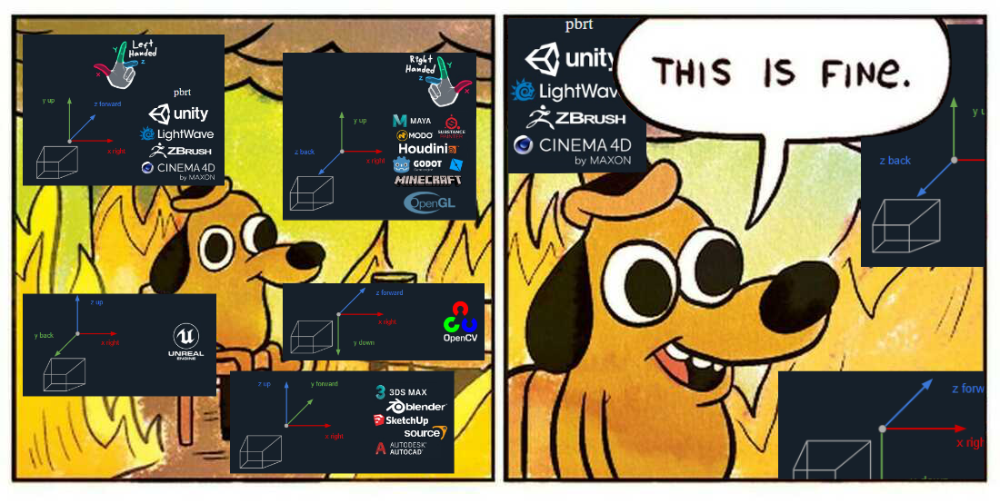

# Frame Transformer
A frame transformation documentation to conquer them all

<p align="center">
  
</p>


Frame transformation between different software is usually a pain.
You always have to go back to finding what where the changes that you have to
make for two specific softwares. With this repo, I want to offer
unified and easy explanations to go back to when in doubt.

The repository itself contains code to exchange from a frame of reference to another
for testing purposes and explanations to change from one frame of reference to another.

## Install

Clone the repository and install the project with:

```
    pip install -e .
```

## Usage

You can use CLI commands to get explanations about the transformations:

```
ft-explain --origin {your-system} --target {the-other-system} 
```

Otherwise, you can go into the code `transforms` to see how they are extracted.

## Code structure

Basically, there is a `FrameTransformer` class that uses code from `transforms` or `explains` to support the main scripts.
The supported systems and transform frames are defined in `systems` and `frames` respectively.

## TODO

- The systems are not tested and they will be tested and extended as required.

- The most inmediate step is to include some origin offsets in translation and/or orientation.
For example, in `airsim`, the initial position is measured with respect to `PlayerStart`, and
the orientation is NED, which ignores the `yaw`.

- I will probably include additional functionalities for `roll`, `pitch`, `yaw` systems.